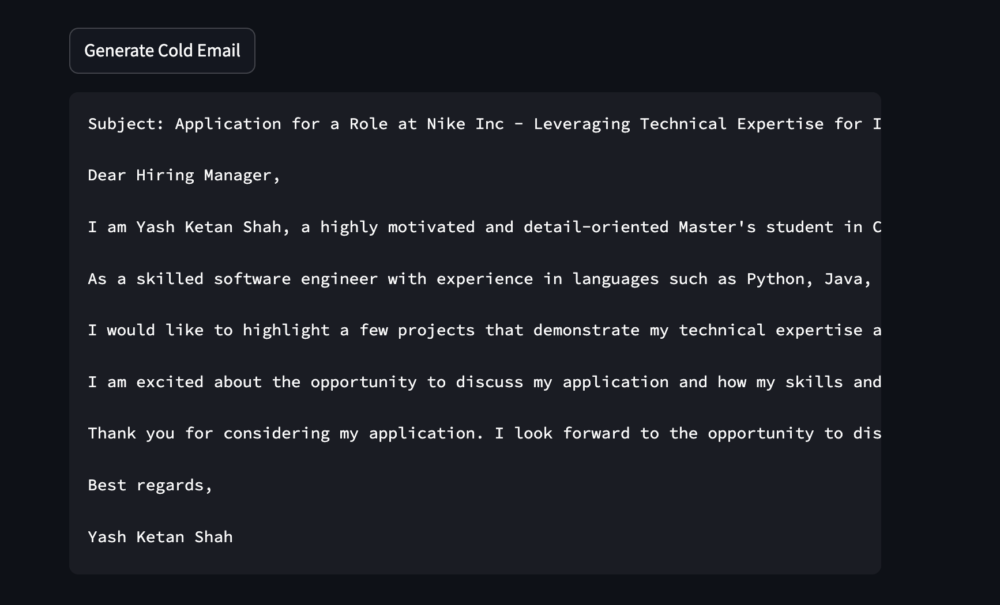

**Cold Email Generator**

**Project Overview**  
This project is a Cold Email Generator web application built using Python, Streamlit, ChromaDB, and LangChain Groq LLM. The app helps users generate personalized cold emails by scraping job descriptions from a given URL, uploading a resume, and integrating relevant project links. The app uses LLM to generate a concise, professional email tailored to the job description.

**Features**  
**Resume Parsing**: Upload a PDF resume that is cleaned and stored in ChromaDB.
**Job Description Scraping**: Automatically scrape job descriptions from a given URL using WebBaseLoader.
**Project Links Integration**: Automatically pull relevant project links from a CSV file to showcase in the email.
**Cold Email Generation**: Use the ChatGroq LLM to create a personalized cold email, matching your skills and projects to the job description.

**Requirements**  
To run the project, ensure you have the following installed:  

Python 3.8+ 
Streamlit 
PyPDF2 
ChromaDB 
LangChain Groq LLM 
uuid 
csv 
re 
WebBaseLoader 

**Output** 
The following image shows User interface of my cold email generator

 
The following image shows the ouput of cold email generate when resume is uploaded  

